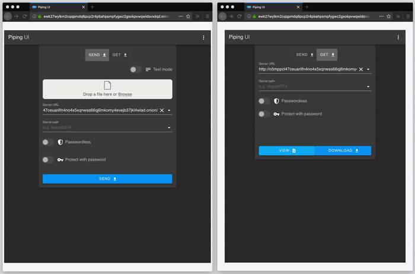

# piping-ui-web-onion-service-docker-compose
[](https://circleci.com/gh/nwtgck/piping-ui-web-onion-service-docker-compose)

[Piping UI](https://github.com/nwtgck/piping-ui-web) as [Onion Service](https://2019.www.torproject.org/docs/onion-services.html.en)



## Run server

You can run Piping UI as Onion Service:
```console
$ docker-compose up
```

Then, `cat docker_volumes/tor_hidden_service/hostname` tells you host name.

## Piping Server as Onion Service

You may be interested in hosting [Piping Server](https://github.com/nwtgck/piping-server) as Onion Service. See <https://github.com/nwtgck/piping-server-onion-service-docker-compose>.
